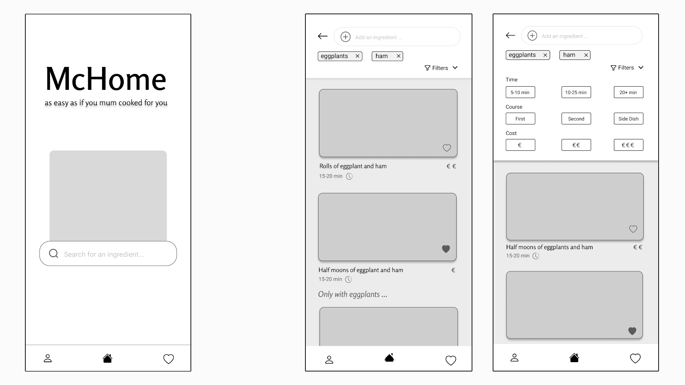

# Milestone 3: Wireframe - McHome

## Wireframe

For the creation of the medium-fidelity prototype, of our web application for mobile devices, we chose to use the prototyping tool [Figma](www.figma.com). It allowed us simply and immediately to create two connected screens shown below.

   

In addition to the home screen, we have decided to show a second page containing the search result by ingredients with recipes that meet the requirements. We have chosen this screen because the resulting recipes are the main functionality of our application, and must be able to be consulted easily wherever the user is. We also created a second version of that screen, with the filter bar open to show all features.

Following the analysis of the evaluators carried out during M2, in the prototype we have decided to show those main changes:
Make it clearer what can be searched for by using the search bars, both on the homepage and the screen showing the resulting recipes
A more consistent way to return to the main screen to start the search for a new recipe

A higher resolution version of the prototypes can be found [in this PDF document](https://github.com/polito-hci-2021/McHome/raw/master/M3/images/medium_prototype.pdf).

