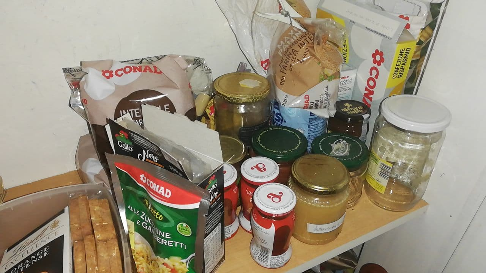
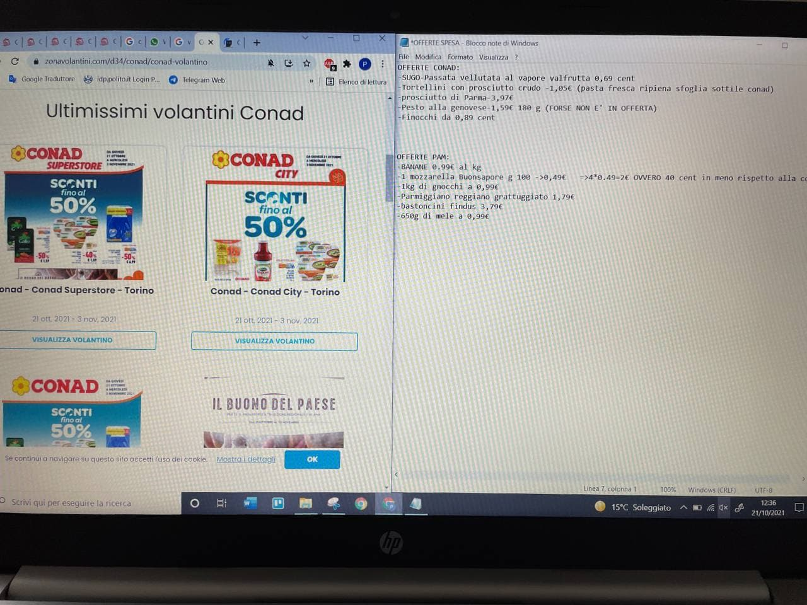
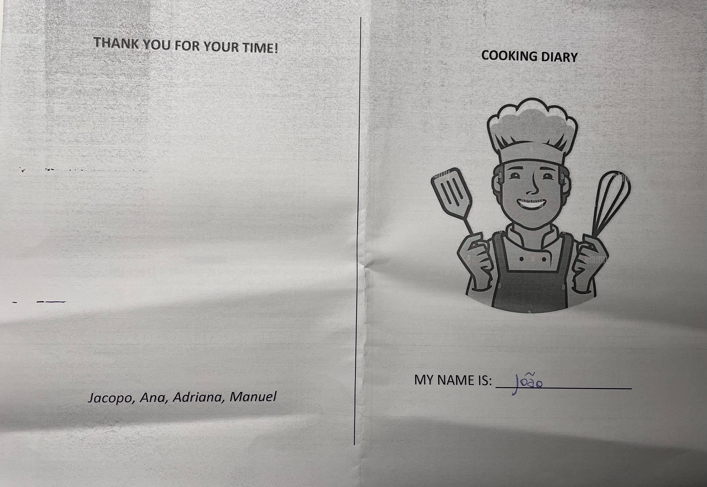
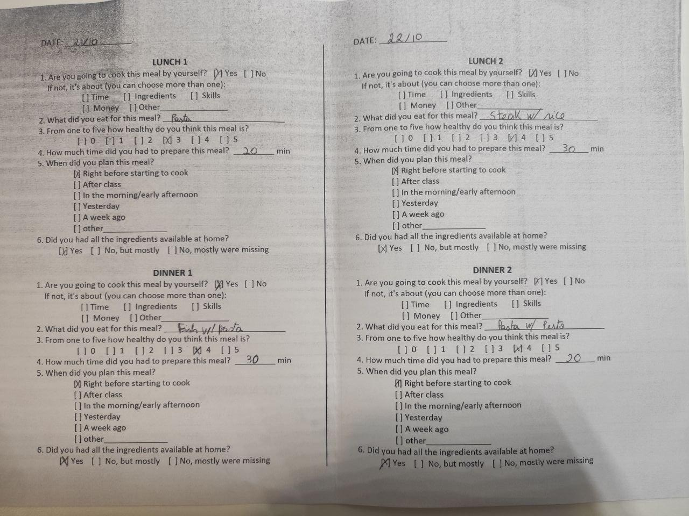
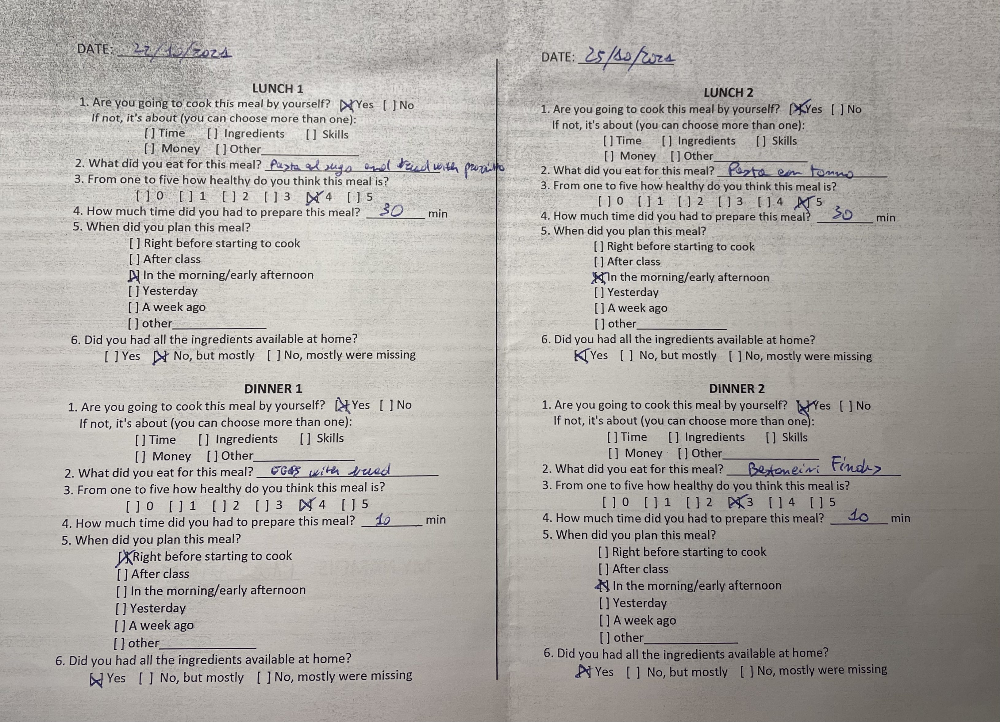
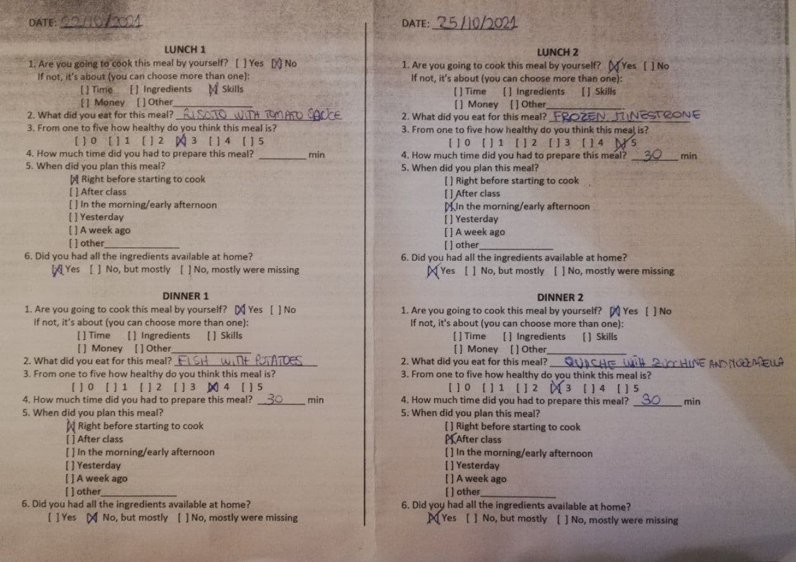

# Milestone 1: Project description and Needfinding: McHome

## Overview and planning
Our group wants to observe the process that university students go through when planning their meals. We focused on situations where they have a short amount of time for planning, preparing and eating the meal. Additionally, we would like to understand how healthy the students perceive their meals and if they would like to improve this aspect.

Our focus is off-site students, both Italian or international because they have to prepare their meals by themselves.

Furthermore, we decided to categorize them based on their cooking skills and their off-site experience. Thus, we are going to observe:

- two new to cooking students: never cooked meals alone before the current academic year
- two already used to cooking students (one of them being an international student)

We wanted to observe both new to cooking and experienced ones because their experience in managing time and ingredients could be different.

The selection of an international student was made thinking about the extra difficulties they might have based on different cultural backgrounds. Thus, they might have more problems with the ingredients selection.

These observations allowed us to comprehend the cooking preparation habits of students: time management, ingredients' shopping, meal decision, ingredients usage... Thus, we're able to validate the necessities of the students we thought to exist previously that were the centre of our project idea. This is because we want to provide students with a tool to help them prepare quick and healthy meals with the ingredients they have available at home. 

## Observation
### João - Experienced cooking student 

João is an international student in his last year of studies. He has been an offsite student for the whole duration of his career. Thus, he already has a good cooking experience.

   
  <em>João's almost-empty-fridge.</em>

In the observation, we were able to see that the place where the student cooks is small. In the cooking preparation, he gathered all the ingredients and tools needed to start cooking the meal, showing that he is organized when cooking. When retrieving the ingredients for the meal, we could observe that neither the fridge nor the pantry of the student was very full. This might indicate that the student doesn't do a lot of advanced planning of his meals.

The meal preparation took about 25min.

### Paolo - New to cooking student 

On the day of the interview, in the morning, paolo had class so he took some ingredients right away before returning home. He has a grocery list on his phone to don't forget anything when he goes shopping.

   
  <em>Paolo's grocery list on his phone.</em>

Paolo is not yet a capable cook. Thus, he often cooks the same recipes using the same ingredients. He mentioned that he is cooking with the identical ingredients as the day before. This way, except for one or two purchased before, he had all the ingredients available at home. However, he also said that he would like to improve the lack of variety of ingredients. Excluding weekends, he feels that he often doesn't have time to try something new.

His meal preparation took about 20 min.

### Alessia - New to cooking student 
Alessia is an Italian student who decided to enrol in Politecnico of Turin last year for her master's degree. She has been an off-site student for a year because she attended a university that is very close to her place for her three-year degree. However, she is not used to cooking now, even if she has one year of experience. 

The observed student seems to be organized, at first glance: she had all the needed ingredients in her fridge so she didn't have to go shopping for something missing. She decided what to eat right before starting to cook and without opening the fridge to see what was available. She prepared pasta with pesto and took 15 minutes to prepare her whole meal, 5 minutes to boil the water and 10 to cook pasta and dress it with pesto. She was happy about that because she could also rest a little bit before coming back to class. 

   
  <em>Alessia's pantry in her kitchen.</em>

What it was possible to observe in her pantry is that there is a lot of rice, pasta, tuna and a set of different sauces. All lead to say that the student prefers to cook easy meals and the biggest priority is to spend a small amount of time. 

### Ramon - Experienced cooking student 

Ramon is an Italian student in his last year of studies. He has been living alone for some years and he's used to cooking his meals by himself. He has a daily plan with a well-defined list of ingredients.

It was possible to observe that as a used-to cooking student, he has already-prepared ingredients stored in the fridge to prepare his meal. Furthermore, he already had everything he needed to start cooking. 
Another observation made was that in the pantry, he stores a large amount of dry food.

His meal preparation took about 25min.

## Interviews
### Questions

1. Do you plan your meals? 

> João: He doesn't plan his meals but he shops weekly for ingredients that can be used for meals.

> Paolo: Yes, he does. Even if it's his first year living alone, Paolo is a well-organized student. He searches online for available offers in the grocery shop near his house and selects the discounted ingredients he likes.

  
   
  <em>The way Paolo uses notepad to write down offers he found in the jurnal of the grocery shop near his house.</em>

> Alessia: She doesn't plan very much because she often eats the same things. She usually goes shopping twice a month and buys all she needs for preparing these meals. This way, she often has almost everything in her fridge.

> Ramon: He plans his meals because sometimes he brings food with him to the university and other times he goes to the canteen

2. <em>[Optional: if they plan their meals]</em> How much time before each meal?

> Paolo: He decides what to eat early in the morning after breakfast.

> Ramon: He plans his meals the day before

3. <em>[Optional: if they don't plan their meal]</em> When do you choose what to eat?

> João and Alessia: Right before the meal

4. <em>[Optional: if they don't plan their meal]</em> If you don't have all the ingredients at home, how do you solve this issue?

> João: Because he usually decides right before cooking, he simply chooses his meal based on the ingredients available. Rarely he goes shopping before cooking.

> Alessia: It hardly ever happens, but when it does she usually changes her plans and eats something else using the ingredients that she has available.

5. How much time do you usually take to cook the food? 

> João: Usually takes 30min opting for simple meals.

> Paolo: He usually takes between 20 and 30 minutes to prepare his meal.

> Alessia: She prepares only super easy recipes that require 15 minutes for lunch and 30/45 minutes for dinner.

> Ramon: He usually spends not more than 30 minutes preparing his meals. 

6. How hard is it for you to cook your meal with the time you have available? Very hard? Hard? Ok? Simple? Very simple?

> João: Ok.

> Paolo: Time management for him is ok. The problem is that sometimes cooking takes longer than he expected so he happens to be late.

> Alessia: Pretty simple

> Ramon: Simple

7. How hard is it for you to come up with the recipe for the meal? Very hard? Hard? Ok? Simple? Very simple?

> João: Simple.

> Paolo: Simple. He's used to cooking the same ingredients, so it's not hard for him to come with a recipe.

> Alessia: Simple, since she always does the same dishes. She rarely buys seasonal vegetables that she doesn't know how to cook and searches for recipes on the Internet.  

> Ramon: Simple, He has a nutritional diet and so he has a daily plan. He has a well-defined list of ingredients that he's used to cooking so he doesn't find it hard to come up with a recipe.

8. Do you think that the recipes you find in the books or online are too difficult or time consuming for you?

> João: He doesn't find it very hard to find recipes to cook nor to find the ones he needs online.

> Paolo: Sometimes, the recipes that he finds online are too difficult and time-consuming.

> Alessia: She tries to find some recipes on the Internet but she finds that they require more time than she can or wants to spend.

> Ramon: He finds that online recipes are usually time-consuming.

9. Would you like to improve the variety of dishes that you eat?

> João: Yes, he would like to.

> Paolo: Yes, he'd like to cook something different sometimes.

> Alessia: Yes, she would like to, but new recipes always seem very difficult for a new learner like her. 

> Ramon: Sometimes yes.

10. When you cook your meal at home, how healthy do you think your recipes are? On a scale from 1 to 5 (1 being the least healthy)

> João: Healthwise, he rates his meals as a 3/4.

> Paolo: He said 3 out of 5. He thinks that most of his meals are healthy but not all of them.

> Alessia: 4, she thinks that she eats quite healthy.

> Ramon: 5. They are very healthy because he prepared them at home with all the ingredients from his diet.

11. <em>[Optional: if they don't think their meals are very healthy]</em> Would you like to improve your diet so it can be healthier?

> João: Yes, maybe sometimes he would like to choose something healthier.

> Paolo: Yes, he'd like to, but laughing he said that healthy recipes usually take a long time to do.

12. How often does it happen to you to let ingredients go out of time?

> João: Too often. The biggest issue he pointed out was the amount of food he feels that he lets go to waste.

> Paolo: It's not so often that he lets the ingredients go out of time, but sometimes happens.

> Alessia: Not often, she is getting better. She said that she tries to not waste food by putting ingredients that are easier to forget in the front of the fridge.

> Ramon: He doesn't waste food because he buys it weekly knowing what he's going to eat.

## Diary
Student days can vary a lot since their schedule changes daily. To better understand their needs, we decided to deepen our knowledge of their habits with the help of a diary. We asked to fill it for two lunches and two dinners on two weekdays. For each meal, we asked the same questions that could be completed quickly. 

### João's diary

  

  

João spent on average 20 minutes cooking. He opted for quick and easy to do meals. We can see that he never planned his meals in advance but surprisingly, he didn't have a problem with missing ingredients. That's because he probably cooked based only on what he had available. We can also observe that pasta was, three times out of four, a central ingredient in his meals. However, he thinks that his meals were healthy enough.

### Paolo's diary

  

Paolo spent on average 20 minutes cooking. Except for one day, he had all the ingredients available at home, probably because he is good at organizing himself. For most meals, he chose what to eat in the morning. He had the perception that his dishes were quite healthy, even if he fried the ready-made frozen fish and he ate carbs in most of his meals.

### Alessia's diary

  

Alessia spent on average 30 minutes cooking. We can see that she doesn't plan her meals and decides what to eat just before starting to cook or a little earlier. She has most of the ingredients available at home, probably because she eats very simple meals with some ready-made ingredients. We can also see that for the first lunch she didn't prepare the meal by herself. Despite this, she believes that her preparations were quite healthy.

### Ramon's Diary

  

Ramon spent on average 10 minutes cooking. We can see that on the first day he planned what to eat in advance. On the second day, his decision to eat lunch happened right after class and he had a "take away pizza" for dinner. He had all the ingredients he needed available at home except for the second-day dinner. We can also see that he's used to cooking healthy food.

## User Needs
After interviewing the students we were able to identify several user needs:

1. Improve the variety of dishes prepared
2. Enhance their cooking skills
3. Recipes that take less time than ones online or in books 
4. Reduce wasted food
5. Healthier recipes

## Project Description
Our project will include the possibility to search for quick and simple recipes based on specific ingredients with attention to healthy meals.
Due to the ease and immediacy of use, our project will consist in a web application for smartphones.
