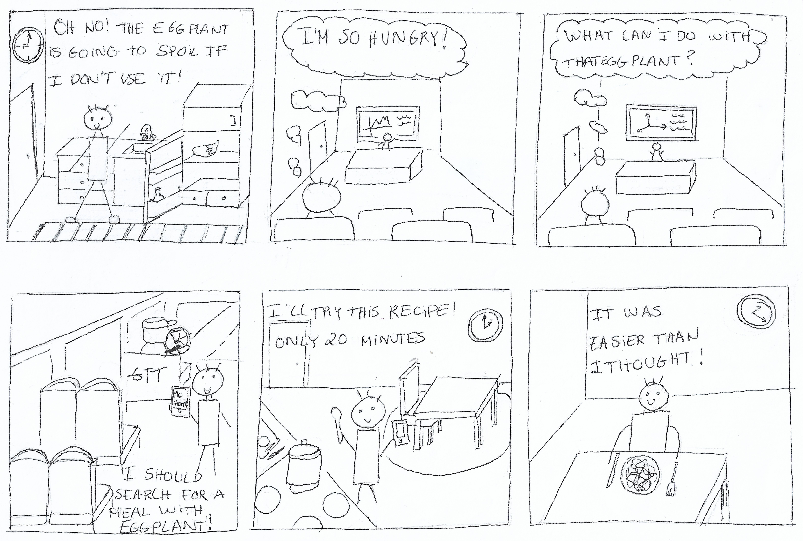
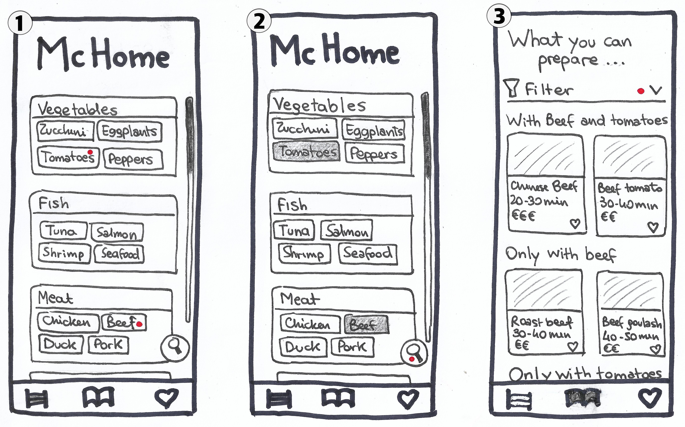
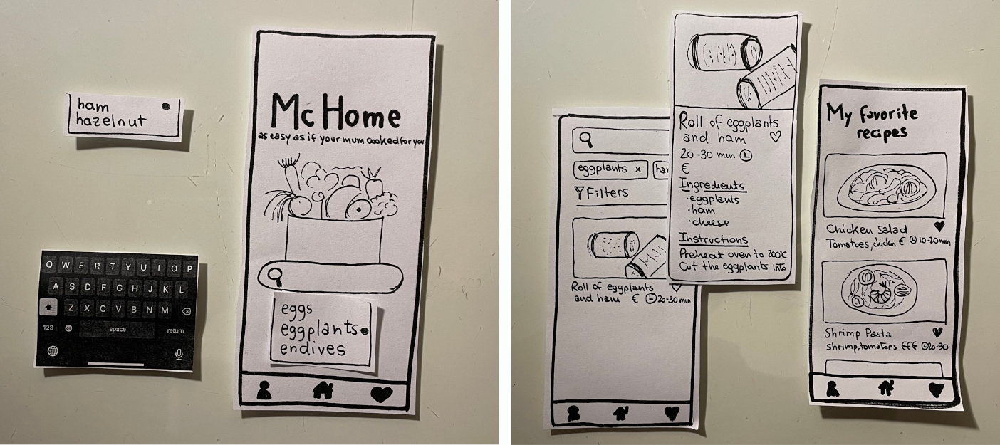
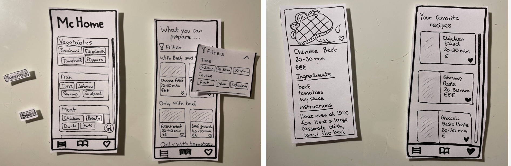
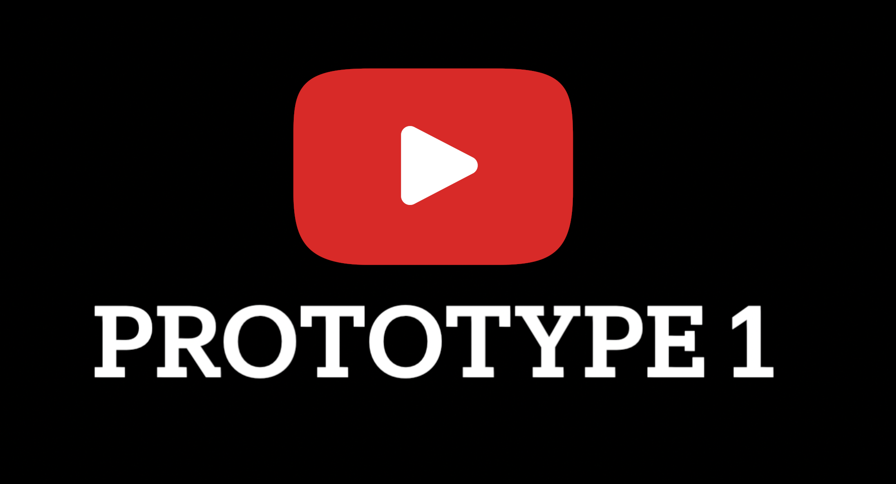
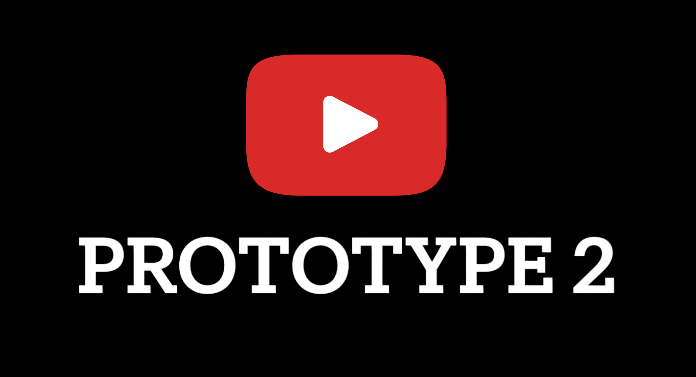
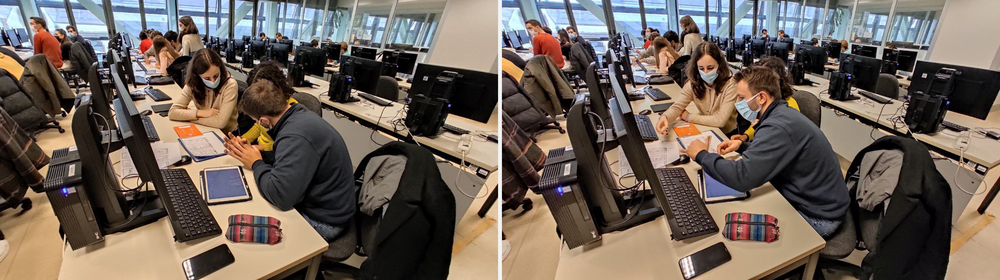

# Milestone 2: Prototyping and Heuristics - McHome

## Storyboards

The storyboard represents a typical student day. At the beginning of the day, the student notices he has an old eggplant in the fridge. Later on, he starts to get hungry in classes and reminds himself that he should think about a way to cook that eggplant. Thus, on his way home, he searches for recipes with eggplant in the McHome app. At home, he finally decides on a quick recipe. In the end, he expresses his content with his experience. 

   

The storyboard highlights a common situation in a regular student day since they are our target user group. Moreover, it shows how the McHome app can be helpful for that. More specifically, it focuses on timesaving recipes, reducing waste food and easy recipes selection. The aforementioned is achieved by representing a student that wants to use an eggplant so it doesn't spoil and finds the solution for this problem with the McHome app. Besides that, he found an easy and timesaving recipe, two common demanded needs in student life. This gives the idea that it could be the reason he chooses those characteristics. 

Furthermore, the way he solved his problem highlights the easiness to incorporate the app into his daily life. Thus, we can say that this storyboard represents very well the user needs. 

We consider the strengths in this storyboard the following:
* Ability to correctly represent the user need
* Simple drawings that focus on the main goal instead of details

The weaknesses: 
* The storyboard shows a specific situation, which is when the ingredient is about to spoil. Our app can also be used in general situations, for example with an ingredient of user's choice

## Paper Prototypes

### Prototype 1

   

1. Main screen of the app. It is possible to search for an ingredient desired to be used for the meal
2. The scene displays a list of recipes that include the selected ingredient
3. It is possible to insert an additional ingredient, apply a filter or select a recipe

   

4. Looking for an additional ingredient, the list will update showing the recipes that meet the requirements
5. By selecting a recipe the user can read its details and also add them to his favourite ones
6. The favourites button at the bottom right of the navbar takes us to the list of the user's favourite recipes

The search for recipes based on an ingredient is the main feature of the application. Afterwards, starting from the choice of it, the user can refine the search by filtering, for example, based on the time he has available for the preparation of the dish.
The application is easy to use and can be used anywhere, even on the bus home. The favourite recipe list allows the user to quickly find a recipe he loves.

### Prototype 2

   

1. The main screen is shown with a list of food subcategories, along with some possible choices
2. It is possible to choose by touching one or more ingredients 
3. By searching, the list of recipes that meet the requirements is shown. At the bottom of the list are also shown the recipes with only some of the selected ingredients

   

4. It is possible to apply a filter to show only recipes that meet certain requirements, such as the course one
5. By selecting a recipe the user will find more details and the possibility to add the recipe to his favourites
6. The last icon of the navbar, the one in the shape of a heart, takes the user to the list of his favourite recipes

This second prototype of the app helps the user with the recipe choice showing a list of predefined ingredients. In this way, he can discover new ingredients that he may not have previously considered. The recipes that meet the requirements are shown clearly, with an addition of a few that consider only some of the ingredients inserted, to increase the possibilities of choice. Filtering recipes are quick and easy, as is browsing his favourites list.

### Final thougths
While the two applications are different in terms of graphics, both have the same purpose: to start from some ingredients available in the student's fridge, to show some easy-to-prepare recipes.

The first one focuses on the search for a single ingredient that can be refined later by adding some others or using filters. It is immediate and simple to use, designed to be used quickly on the way home or in the classroom.

The second prototype has a higher level of detail right away, allowing the student to choose more than one ingredient for his research from a proposed list. Even if it is less immediate at first look, in this way it could help the student in the construction of the recipe, offering him a way to vary his diet more.

How the details of the recipe are shown is almost similar between both, as well as the possibility to apply filters or display the favourite recipe list. The final result is the same: a recipe that meets his time, budget and course requirements, while also allowing him to empty his fridge.

## Heuristic Evaluation
For the heuristic evaluation, we used the paper prototypes shown previously, appropriately cropped to simulate user actions. We recreated the dynamic changes of the screens so that the evaluators had a close experience to a real user experience.

   
  <em>Prototype 1 pictures taken by the facilitator during the evaluation</em>

   
  <em>Prototype 2 pictures taken by the facilitator during the evaluation</em>

The evaluators were able to test the application, noticing some shortcomings in terms of usability that we had not considered before.

To achieve this, the facilitator started by briefly explaining the idea of our application to the evaluator. She also proposed to the evaluators to analyse the situation as like they were off-site students since it is the target group of our application. Then it proceeded to simulate an experience for both prototypes while explaining the actions. 

A simulation of how it was conducted by the "facilitator" group member and the "computer" member can be seen live in these two youtube videos:

   

 
Furthermore, the facilitator has taken note of some relevant changes to apply to our initial idea, especially to make it clearer and easier to use.
  

Our evaluators were Dario and Caterina from the "PlanB" group. One of the main problems they pointed out, concerns the user's difficulty in returning to the previous screen to change his search choice. They also noticed that it is not clear what is required to search for at the beginning, whether a recipe or an ingredient. The complete list of the heuristic observations can be found [in this spreadsheet](https://docs.google.com/spreadsheets/d/1b4EV5FjLrLcUdsdpHs_LZsMHt-NNBCAO57-dn3FTfLA/edit#gid=1366595915).

   
  <em> Dario, one of the evaluators, testing our prototypes.</em>

After carefully thinking through the recommendations in the evaluation made we decided that focusing on improving the first prototype would be the best option for our project. We made this decision because this version had what we consider a crucial feature for the usage by the target group: it can be used quickly and easily wherever the person is.

To achieve this, we come up with a list of potential changes to improve it:
* Add a clear explanation of what can be searched in the homescreen search bar (issue 1)
* Add a breadcrumb component to provide the user with a clear way to understand where they are (issue 2)
* Modify the visual appearance to better guide the user to add more ingredients to the recipes list page (issue 3 and issue 6)
* Add back button in the recipes' pages to go back to the search page to improve navigation in the app (issue 5)

By implementing these changes the user will be able to use the application in an even more immediate way.

