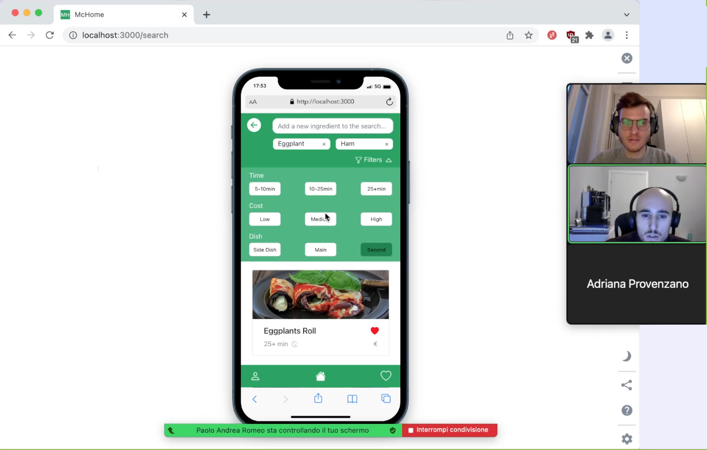
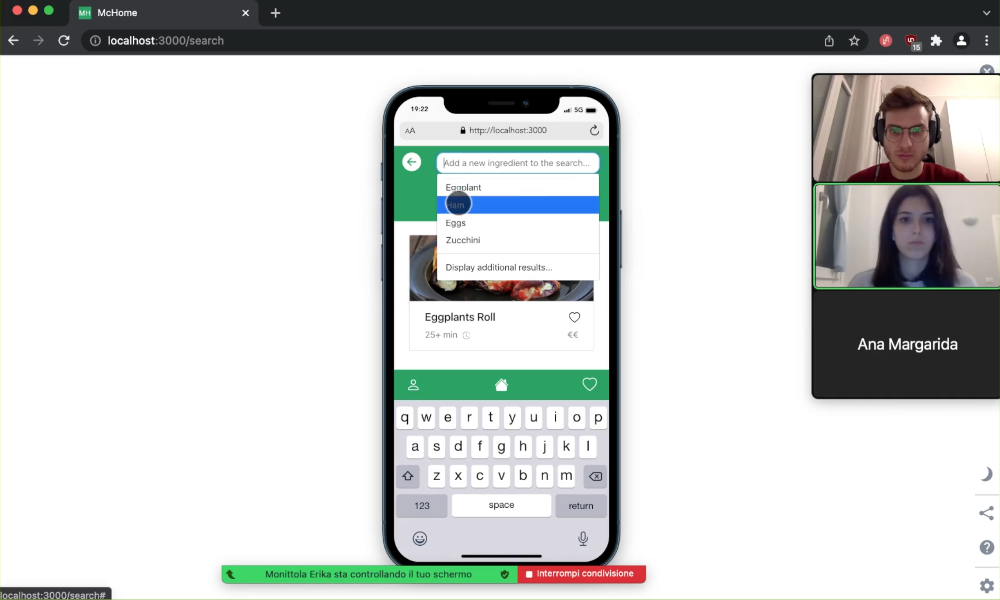
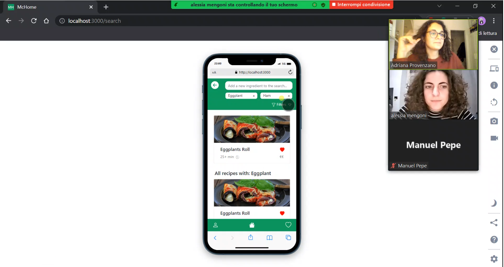
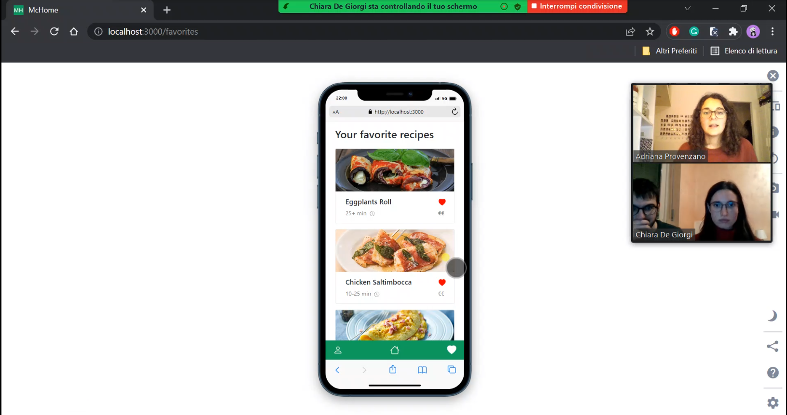
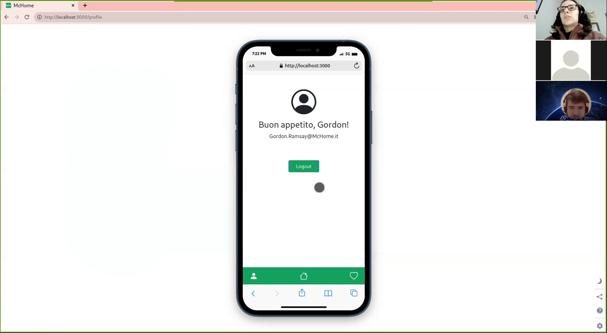

# Milestone 4: Usability Testing - [McHome]

## Overview and Script

This test aims to evaluate the usability of the McHome web application from the perspective of an offsite university student. The five users that will perform the usability testing will be screened to ensure that they are between 19 and 25 years old and enrolled in a bachelor's or master's degree. They should have poor or basic cooking skills and already experience using smartphones.

Because of the actual pandemic situation, we will conduct the tests on Zoom. We will provide participants with links for the call and use our computer with the web application already open and working in a mobile simulator to take the test. They will share their webcam while they interact with our shared screen. The test evaluation will include a post-test questionnaire.

The test objectives for the usability study are to evaluate the website relative to the user's ability to:

- Search for a recipe by an ingredient
- Refine the search by adding another ingredient
- Add a recipe to the favorites and browse them

More details can be found in the usability testing protocol, including the script, [at this link.](https://github.com/polito-hci-2021/McHome/blob/master/M4/additional_files/usability_testing_protocol.md)

## Results and List of Changes

In the next section we report our results, noticed elaborating the notes taken during the usability test, and impressions, obtained from the quick debrief we had with the participants at the end of the session. We then analyze the times taken for the tasks that required it and the results of the post-test questionnaire. Finally, we will illustrate a list of possible changes.

All the signed informed consent can be found [on this page.](https://github.com/polito-hci-2021/McHome/tree/master/M4/additional_files/informed_consent_signed)

### Success and pain points
The first user to test the McHome app was Paolo. During his trial, we noticed that in the task "Filter recipes based on a medium budget" the buttons to filter the cost in the dropdown menu were not very explanatory, as the user did not immediately understand the correspondence (Medium cost)->(€€). Beyond this, he had no particular difficulties using the application and enjoyed it.

   
  <em>Paolo asked us how he could see the cost of a recipe from the search page.</em>

Erika was the second user who tested our app. She used the app smoothly from the start, showing no difficulty in solving tasks. This easiness may happen since Erika told us that she is very comfortable with social networks and smartphone applications during her recruitment. This way, she may have found a common thread with our app, and we are pleased about this.

   
  <em>Erika performing one of the tasks, add a second ingredient to the research.</em>

The third user was Alessia. She found the application very easy to use and really liked that she could filter recipes based on the budget and how much time she spent cooking. Since she is a creature of habit, she said that she would use the "favorite recipes" feature a lot.
A problem highlighted by Alessia was related to the repetition of recipes following the search: in fact, as we can see from the screenshot below, the "Eggplants Roll" recipe is shown both as a result of the search for recipes with "Eggplant" and "Ham", and also in the list of suggestion "All recipes with: eggplants". We thought of the second section as a possible help for students who may not have found recipes they like with other ingredients or filters they applied, but we also believe that the page should not display duplicate recipes with the first section.

     
  <em>Alessia, with the duplicate recipe. As we can see it is in the list of result and also in the list of suggestion based on the first ingredient added.</em>

In the fourth test, Chiara could use the app without any additional help. She explained that she would use the application frequently, but she would like some suggested recipes displayed on the main screen to get some inspiration. She also added that an older user might not successfully search for recipes by ingredients. Instead, they would try to search directly by the recipe's name according to some websites about cooking. Nevertheless, we believe that in the search bar, it is well specified that you have to start from an ingredient, not from a recipe. Precisely for this reason, showing example recipes on the main page can be equivocal.

   
  <em>Chiara, consulting her favorite recipes.</em>

The fifth and final test with João was successful. He was able to complete all the tasks without significant missteps. At the end of the testing, João gave feedback that we would appreciate that the filter window would close automatically after applying one filter. However, since we want to allow users to apply more than one filter at once, we decided to leave that feature.

   
  <em>João, consulting the account email.</em>

### Evaluation findings
After testing the five users, all candidates could complete all tasks effortlessly on their own. The tasks for which the success criterion required recording times are the following:

| #                | Task 1 (25 sec) | Task 2 (20 sec) | Task 3 (20 sec) |
| ---------------- | --------------- | --------------- | --------------- |
| Paolo Romeo      | 20 sec ✅       | 18 sec ✅       | 13 sec ✅       |
| Erika Monittola  | 11 sec ✅       | 10 sec ✅       | 5 sec ✅        |
| Alessia Mengoni  | 20 sec ✅       | 7 sec ✅        | 7 sec ✅        |
| Chiara De Giorgi | 22 sec ✅       | 8 sec ✅        | 4 sec ✅        |
| João Martins     | 10 sec ✅       | 16 sec ✅       | 19 sec ✅       |
| Average          | 16.6 sec        | 11.8 sec        | 9.6 sec         |

As can be seen, users could meet the limits set by the team in the definition phase. 

In the first task, we can see that two users scored near half the time as all the other users. One of the users was Erika, and she was consistent in scoring shorter times for all the tasks, which might imply a more experienced user. However, in João's case, the result might reflect that the user is used to experiencing a similar search feature in his daily life given the easiness of accomplishing this task compared to all the others. 

Another interesting observation is consistently scoring less time for most users with the tasks succession- Erika, Alessia, Chiara, and Paolo. Thus, the pattern might reflect system learnability with each previous task. 

In conclusion, all the users were able to meet the tasks time limits, with the last two tasks scoring a considerably smaller time amount than the defined time limit, which gives us confidence in our application usability.

The results of the Post-Test Questionnaire (SUS) are the following:

| #                | SUS score |
| ---------------- | --------- |
| Paolo Romeo      | 95        |
| Erika Monittola  | 100       |
| Alessia Mengoni  | 95        |
| Chiara De Giorgi | 92,5      |
| João Martins     | 100       |

The average score is 96.5. Our score is above the one needed to be considered an above-average result (68). Thus, these results reflect a positive perceived usability of the system by the testing users and contribute to a positive evaluation of our system usability. All questionnaires filled can be found [on this page.](https://github.com/polito-hci-2021/McHome/tree/master/M4/additional_files/post_test_questionnaire_filled)

Analyzing the results more in detail, we can see that most users did not give the maximum score for the question "I think that I would like to use this system frequently". We believe it may be because students don't often go out of their comfort zone in the culinary field, as once they discover a new favorite recipe they tend to cook it often, but despite this everyone has had a positive reaction to the application and this for us it is already a success.

### List of potential changes
The changes we would like to make to our application are the following:

- Buttons to filter by cost could be modified as "Low €", "Medium €€" and "High €€€" to explain the symbol/cost correspondence better. This problem arose first from Paolo's interview, and subsequently, the other users also had hesitations.
- On the results page, when the user adds an additional ingredient or filters, a second section containing recipes with only the first ingredient entered is shown. We implemented this both because the list may be too short, and to give some suggestions to the user. However, we do not believe that it is consistent to show duplicate results between the two sections even if correct, and we will change this behavior of the application. We first noticed this during the Alessia's interview.

Both changes will be reflected in the final version of the app. 
